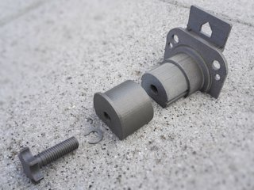
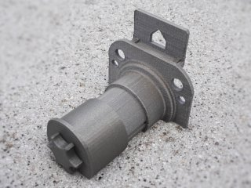

# Adjustable 54mm diameter spool holder for FFCP
*Spool holder with adjustable length for the FlashForge Creator Pro (formerly thing:1741096 and thing:3080068)*

### License
[Creative Commons - Attribution - Share Alike](https://creativecommons.org/licenses/by-sa/4.0/)

### Attribution
This is a remix of the ‘FlashForge Creator Pro 32mm or 50mm center hole Filament Holder’ by RonPossible ([Thingiverse thing:731520](https://www.thingiverse.com/thing:731520)), and my own ‘Easy to print FlashForge Creator Pro 50mm filament holder’ ([Thingiverse thing:1695767](https://www.thingiverse.com/thing:1695767)).

### Gallery

[🔎](images/spoolholder1.jpg) [🔎](images/spoolholder2.jpg) [🔎](images/spoolholder3.jpg) [🔎](images/spoolholder4.jpg) [🔎](images/spoolholder5-FFCP2015.jpg) [🔎](images/spoolholder6-render.jpg)

## Description and Instructions

Tired of printing a new spool holder for every new brand of filament you buy, because they use spools with a vastly or slightly different widths (axle length)? No more with this universal adaptable spool holder. This is *The One Spool Holder to Rule Them All.*

It has an adjustable length that allows any spool with 54 mm center hole to be mounted securely, if its thickness (at the hole) is between 35 and 80 mm or even up to 100 mm if you wish. The length is adjusted with a knob. You can avoid that spools with a recessed axle (like the ones that came with my FFCP) rub against the side, by mounting a spacer ring. See the post-printing section for illustrations.

Another advantage of the adjustability is that the spool holder can act as a *brake,* i.e. the amount of friction can be regulated by tightening the flange against the spool. For instance you can lock an unused spool so it doesn't unwind from vibrations while printing with the other spool (if a spool unwinds, there is a risk that the filament will tangle into itself when you print with it).

There are three end pieces. To make swapping the end pieces easier, print and mount a screw and circlip for each of them.

* Most likely you'll need the 35 mm one, which allows spools with thickness between 55 and 80 mm to be mounted.
* The 15 mm tip is for spool thicknesses between 35 and 60 mm.
* There is also a 55 mm tip, which I added on request but which I have not tested, so I don't give any guarantees that it will work well. This allows mounting spools between 75 and 100 mm thick.

For the 15 and 35 mm tips, you only need the regular ‘new’ screw. You need the ‘XL’ screw for the 55 mm tip. (The old ‘original’ style of the regular screw is also still available, this one has sharper edges for those who like some extra tactile feedback.)
The screw thread is standard M12, should you want to replace the printed version with a metal one.

If you have an older Creator (regular or Pro) with the **round spool mounting holes,** swap out the ‘Base’ model with the ones from the *Pre-2016-FF-creator* folder.

### Printing

I have printed these at 0.27 mm layers for all parts, except 0.1 mm for the screw and circlip. I used 18% infill.

You can scale the spacer in the Z direction if you need it wider or smaller (most slicer programs should allow this).

I recommend to print the screw and the circlip at 0.1 mm layer thickness for accuracy. Ensure the screw is strong because it will have to bear quite a bit of weight. I recommend 3 perimeters and a low infill. You shouldn't rely on infill for strength of parts like these, basic engineering learns that stress will be concentrated in the outer shells. The only real purpose of the infill is to serve as a bridge for the upper layers.

The other parts can be printed at any desired resolution. I used 3 perimeters for all parts, and ensured that top layers are at least 1 mm thick. Again: infill is not terribly important: strength will be mostly in the shell. Provide just enough infill to allow the top layers to be printed correctly.

The base comes in two versions: one with a ready-to-use hollow support that should make it easy to print the nasty overhang, and one without the support if you think your slicer can do a better job at generating supports.
To minimise the risk of the support being knocked over by your unused nozzle, either orient the part such that the support is at the same side as the nozzle you are printing with (for instance, if you print with the right nozzle, the back of the holder should be pointing to the right during printing). Or better: unscrew the unused nozzle.

If you plan to use the 55 mm end piece, you should take extra care to print the base in a strong way because it will need to endure extra stress (moreover the reason why you would want the long end piece is probably because you have a huge and heavy spool to start with…)

## Post-printing assembly

Assembly is straightforward. First put the screw through the end piece and secure it with the circlip. Then screw it onto the base. Mount the circlip as shown, to ensure the tip moves in both directions when turning the screw clockwise or counter-clockwise.

For spools that are considerably wider at the edges than at the axle, mount the spacer ring against the base to keep the flanges from rubbing against the printer.

The spacer can also be used to clamp very narrow spools with the 15mm tip.

## Updates

### 2017/02/12
Added 55 mm tip and longer screw on request.

### 2018/08/05
Made the ‘smooth’ screws even smoother.

## Tags

`50mm`, `54mm`, `Adjustable`, `Brake`, `FFCP`, `FFCPRo`, `filament_holder`, `filament_spool_holder`, `flashforge`, `friction`, `spoolholder`, `spool_holder`
